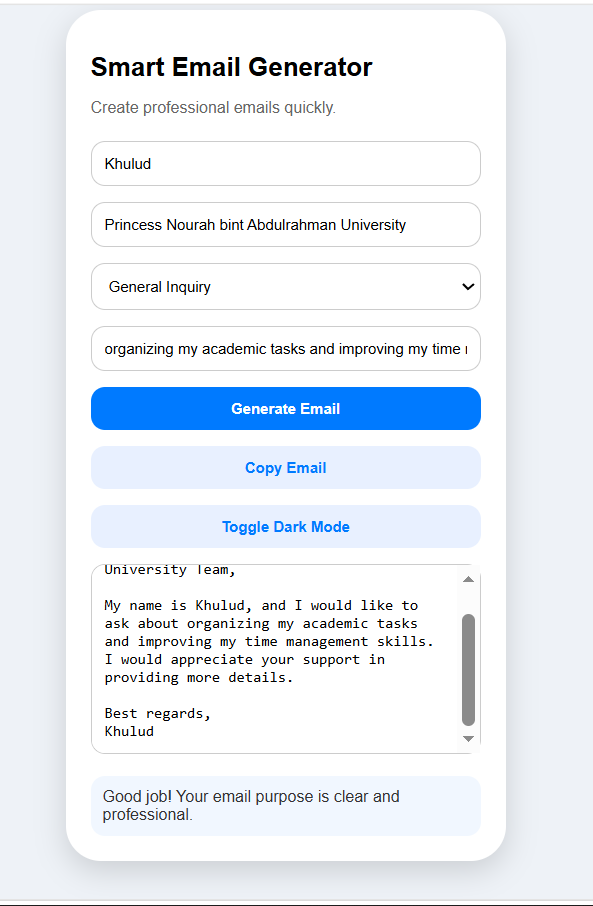

# Smart Email Generator

This is a simple web-based application that helps users generate professional academic emails quickly.

## Features
- Generate emails based on user input
- Copy email easily
- Dark mode support
- Smart tips based on input

## Technologies
- HTML
- CSS
- JavaScript

## Purpose
This project helps students organize and write academic emails in a professional way.

## How to Use
1. Enter your name
2. Enter your university or department
3. Select email type
4. Write your purpose
5. Click "Generate Email"

## Screenshot
